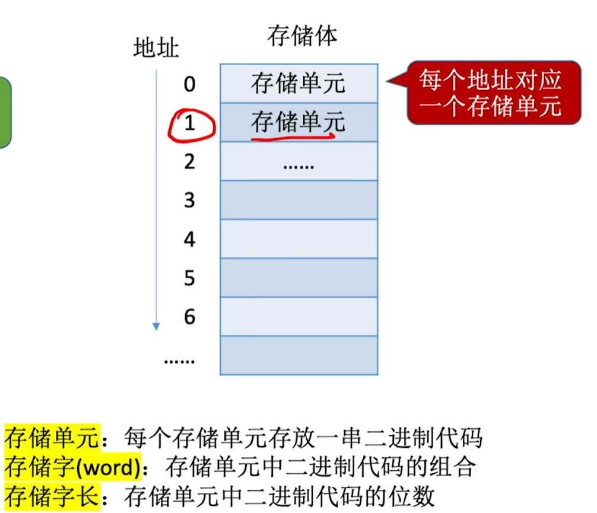

# 第一章 计算机系统概述

## 一、计算机的发展历程
### （一）计算机系统的定义
计算机系统由 **硬件** 和 **软件** 组成。

==硬件只能识别二进制机器语言==

软件又包括：  
- 系统软件：用于管理整个计算机系统，如操作系统、数据库管理系统等。  
- 应用软件：按任务需求编制的程序，可理解为日常使用的各类 APP 。  

### （二）硬件的发展
硬件发展以 **逻辑元件类型** 为标志，集成程度越来越高，经历四代：  
| 代次       | 时间范围   | 逻辑元件         | 集成特征（补充）               |  
|------------|------------|------------------|--------------------------------|  
| 第一代     | 1946 - 1957 | 电子管           | 无集成，元件离散               |  
| 第二代     | 1958 - 1964 | 晶体管           | 晶体管分立，开始小规模集成     |  
| 第三代     | 1964 - 1971 | 小规模集成电路（SSI） | 数十个元件集成在单一芯片       |  
| 第四代     | 1972 - 至今  | 大规模/超大规模集成电路（LSI/VLSI） | 数千乃至上亿元件集成           |  

### （三）软件的发展
#### 1. 编程语言演进  
从 **机器语言、汇编语言** 逐步发展到 **高级语言**（如 C、Java、Python 等 ），开发效率和可读性大幅提升。  

#### 2. 操作系统迭代  
- 早期：DOS（仅能用命令行操作计算机 ）  
- 现代：Windows、Android、iOS（图形化操作界面，易用性显著提升 ）  

### （四）当前发展趋势  
呈现 **“两极”分化** 特点：  
- 微型计算机：向更微型化、网络化、高性能、专用化方向发展（如智能穿戴设备、嵌入式系统 ）。  
- 巨型计算机：向更巨型化、超高速、并行处理、智能化方向发展（如超级计算机用于科学计算、大数据分析 ）。  

## 二、计算机硬件的基本组成
### （一）早期冯·诺依曼机  
冯·诺依曼提出 ==“存储程序”== 概念：将指令以二进制代码形式，预先输入计算机主存储器，使计算机按程序自动执行。  

#### 冯·诺依曼机结构

- **输入设备**：将信息转换为机器可识别形式（如键盘、鼠标 ）。  
- **存储器**：存放数据和程序（如内存、硬盘 ）。  
- **运算器**：负责算术运算、逻辑运算（核心为 CPU 中的运算单元 ）。  
- **控制器**：解析存储器中程序，指挥运算器运行（CPU 中的控制单元 ）。  
- **输出设备**：将结果转换为人类熟悉形式（如显示器、打印机 ）。  

#### 软硬件逻辑等效性  
从**功能实现**的角度来看，对于同一功能需求，==既可用软件实现，也可用硬件实现==，但存在差异：  
- 软件实现：依赖现有硬件资源，通过算法/逻辑间接完成（如用多次加法模拟乘法 ），效率较低，成本较低。  
- 硬件实现：直接在物理层面设计电路完成功能（如专用乘法器 ），效率更高，成本更高。  

`(虽然软件运行的时候得依靠硬件，但软件是通过不同算法和逻辑，借助硬件提供的基础能力来达成同样的功能目标。而硬件则是直接在物理层面去实现这个功能。)`

### （二）冯·诺依曼计算机的特点  
1. 由 **五大部件（输入、存储、运算、控制、输出设备）** 组成。  
2. 指令和数据以 **同等地位** 存于存储器，可按地址寻访。  
3. 指令和数据用 **二进制** 表示。  
4. 指令由 ==操作码==（执行动作）和 ==地址码==（操作对象）组成。  
5. 遵循 **存储程序** 原理，将程序指令和数据以二进制代码形式，预先存入计算机主存储器，计算机按地址自动顺序执行指令，实现程序驱动的自动运算。  
6. ==“以运算器为中心”== 输入/输出设备与存储器的数据传送需经运算器中转，导致数据通路拥堵。现代计算机优化为“以存储器为中心”，I/O 设备可直接与存储器交互，提升数据传输效率。  

### （三）现代计算机的结构
#### （一）整体架构
现代计算机以 ==存储器为中心== ，结构可划分为：
- **主机**：包含 CPU（运算器 + 控制器）、主存储器 
- **I/O 设备（外设）**：输入设备、输出设备  

结构示意图：

`(CPU是芯片)`

关键关系：  
- ==CPU = 运算器 + 控制器==
- ==主机 = CPU + 主存储器==  
- ==计算机硬件 = 主机 + I/O 设备==  
- 存储器又分主存（运行内存）、辅存（机身存储，如硬盘）  

## 三、主机硬件工作原理
### （一）主存储器
主存储器用于存储数据和程序，核心组成及原理：  

#### 1. 核心部件  
- ==MAR（Memory Address Register，存储地址寄存器 ）==：存放要访问的存储单元地址，MAR的位数反映存储单元的个数(如4位MAR，则最多共有 \( 2^4 \) 个存储单元)  
- ==MDR（Memory Data Register，存储数据寄存器 ）==：存放从存储单元读取或写入的数据，MDR的位数反映存储字长(如16位MDR，则每个存储单元可存放16bit，即一个存储字=16bit)  

#### 2. 存储单元映射  
存储体由多个存储单元组成，每个地址对应一个存储单元：  

#### 3. 关键计算 
- 存储单元数量：若 MAR 为 \( n \) 位，可寻址的存储单元数量上限为 \( 2^n \)（地址编码范围 \( 0 \sim 2^n - 1 \)），实际存储单元数量需是 \[2^m \quad (m \in \mathbb{Z}, \, 0 \leq m \leq n)\]。  
- 存储字长：MDR 位数决定，通常为 8 的整数倍（如 8bit、16bit 等 ），==1 字节（Byte/B）= 8bit(b)==，一个bit即一个二进制数  
- 现代计算机中，MAR、MDR 常集成在 CPU 内  

### （二）运算器
运算器实现算术运算（加减乘除 ）、逻辑运算（与或非等 ），基本组成：  

#### 1. 核心部件  
- ==ACC（累加器 ）==：存放操作数、运算结果  
- ==MQ（乘商寄存器 ）==：乘、除运算时，存放操作数或中间结果  
- ==X（通用操作数寄存器 ）==：存放操作数，通常含多个  
- ==ALU（算术逻辑单元 ）==：核心，通过复杂电路实现运算  

结构示意图：  

| 部件 | 加法 | 减法 | 乘法 | 除法 |  
|------|------|------|------|------|  
| ACC  | 被加数、和 | 被减数、差 | 乘积高位 | 被除数、余数 |  
| MQ   | -    | -    | 乘积低位 | 商    |  
| X    | 加数  | 减数  | 被乘数 | 除数  |  

### （三）控制器
控制器指挥计算机各部件协调工作，基本组成及指令执行流程：  

#### 1. 核心部件  
- ==CU（Control Unit，控制单元 ）==：分析指令，输出控制信号  
- ==IR（Instruction Register，指令寄存器 ）==：存放当前执行指令  
- ==PC（Program Counter，程序计数器 ）==：存放下一条指令地址，**自带自动加 1 功能**  

结构示意图：  

#### 2. 指令执行流程  
完成一条指令分三步：  
1. ==取指令==：PC 提供地址 → MAR → 存储器读 → MDR → IR ，PC 自动加 1  
2. ==分析指令==：CU 解析 IR 中操作码、地址码  
3. ==执行指令==：CU 输出控制信号，协调运算器、存储器等完成操作  

## 四、计算机的工作过程
以简单程序运行为例，从高级语言到机器执行的流程：  

### （一）程序转换与执行步骤  
1. **预处理**：处理源程序（如 C 语言 ）中的宏定义、头文件等（`hello.c → hello.i` ）  
2. **编译**：将预处理后代码转为汇编语言（`hello.i → hello.s` ）  
3. **汇编**：将汇编语言转为机器语言目标模块（`hello.s → hello.o` ）  
4. **链接**：将目标模块与依赖模块（如 `printf.o` ）链接为可执行文件（`hello.exe` ）  
5. **执行**：可执行文件载入存储器，CPU 按指令周期（取指、分析、执行 ）运行  

流程示意图：  

### （二）指令执行细节 
以代码 `x += PI;`（`PI` 为宏定义 ）为例，机器指令在主存中存储，CPU 通过 MAR、MDR 交互，逐步完成数据读取、运算、存储。关键步骤：  
- 初始 `PC = 0`，指向第一条指令地址  
- 取指令：`PC → MAR → 存储器 → MDR → IR`  
- 分析与执行：CU 解析指令，协调运算器运算，结果写回存储器

流程示意图： 

`((MAR)即MAR的值，M(MAR)->MDR即将此时MAR在存储器中对应的值发送到MDR中)`

## 五、计算机软件
### （一）计算机软件分类  
计算机软件分为==系统软件==和==应用软件==：
- **系统软件**：管理、控制和维护计算机硬件与系统资源，包括：  
  - 操作系统（Windows、Linux）：管理硬件资源、提供用户接口；  
  - 语言处理程序（编译器、汇编器）：将高级语言/汇编语言转为机器语言；  
  - 数据库管理系统（MySQL、Oracle）：管理数据存储与访问；  
  - 实用工具（调试器、性能分析工具）：辅助开发与系统优化。
- **应用软件**：为满足特定应用需求开发的程序，如办公软件（Word ）、游戏、专业工具（PS ）等，基于系统软件运行 。

可结合示意图辅助理解：

### （二）计算机语言层级
计算机语言从底层到高层分为三类：
#### （一）机器语言
- 由二进制代码（0 和 1 ）组成，是计算机硬件==唯一能直接识别和执行==的语言 。
- 示例：指令 `00000101` 可能对应某硬件操作（不同架构指令不同 ）。

#### （二）汇编语言
- 用助记符（如 `MOV`、`ADD` ）代替机器语言的二进制指令，需通过==汇编程序==转换为机器语言才能执行 。
- 示例：`MOV AX, 100` （将数值 100 送入 AX 寄存器 ） 。

#### （三）高级语言
- 接近人类自然语言和数学表达式，如 C、Java、Python 等，需通过==编译程序==或==解释程序==转换为机器可执行代码 。
- 编译型语言（如 C ）：先整体编译为机器码，再运行。后续再次运行时不再需要编译  
- 解释型语言（如 Python ）：边解释边执行。后续再次运行时仍需边解释边执行，效率更低  
- 示例：`y = a + b * c` （高级语言的算术运算表达 ） 。

语言层级关系及转换可参考示意图：

`(编译，汇编，解释的过程可统称为“翻译程序”)`

### （三）计算机功能实现方式的灵活性
#### （一）软件与硬件的逻辑逻辑功能上的等效性
软件和硬件在==逻辑功能==上具有等效性，即对于同一功能，既可以用硬件电路直接实现，也可以通过软件编程，借助硬件提供的基础能力间接实现 。这种等效性赋予了功能实现方式灵活性 。

#### （二）指令集体系结构（ISA/Instruction Set Architecture）
- ==定义==：是计算机软硬件之间的接口规范，详细描述了计算机所能执行的所有指令`(硬件层面能直接识别和执行的指令)`及其功能。
- ==作用==：
    - 让不同层面的逻辑（软件、硬件）能够围绕同一套标准实现功能等效。硬件层面依据 ISA 设计电路，识别和执行指令；软件层面（如编译器 ）依据 ISA 生成可执行代码 。
    - 可简单理解为“一套标准”，其核心作用之一是明确规定了操作码的含义，比如特定二进制序列（如 `0010` ）对应“加法”操作等 。  

## 六、计算机系统的层次结构  
从底层到上层，构建多层“虚拟机器”：  

| 层次       | 名称                 | 功能/转换关系                  | 示例代码/指令               |  
|------------|----------------------|---------------------------------|----------------------------|  
| M4         | 虚拟机器(高级语言机器)         | 用编译程序转为汇编语言          | `y = a*b + c;`              |  
| M3         | 虚拟机器(汇编语言机器)         | 用汇编程序转为机器语言          | `LOAD 5`           |  
| M2         | 虚拟机器(操作系统机器)         | 提供广义指令（系统调用 ）       | -                          |  
| M1         | 传统机器（机器语言 ） | 执行二进制机器指令              | `000001...`（取数指令 ）    |  
| M0         | 微程序机器（微指令 ） | 硬件直接执行微指令              | 微指令 1、3、7...          |  

层次关系：==下层是上层基础，上层是下层扩展==
`(虚拟机器所使用的语言不能直接被硬件理解，可理解为抽象的机器)`  
`(微指令即硬件对二进制指令的具体操作步骤)`

## 七、计算机性能指标
### （一）静态指标（部件能力）  
#### 1. 存储器指标  
- 总容量：`存储单元个数 × 存储字长（bit）` 或 `存储单元个数 × 存储字长（Byte）`（1Byte=8bit）  
- 关键关联：MAR 位数决定存储单元数量（\( 2^{\text{MAR 位数}} \) ），MDR 位数决定存储字长  
(总容量表示的是最大容量，实际容量可能小于最大容量，\(2^{\text{31}}\)<实际<=\(2^{\text{32}}\))

#### 2. CPU 指标  
- ==时钟信号（Clock）==：周期性的电信号  
- ==时钟频率（主频）==：单位 Hz，如 2GHz 表示每秒振荡 20 亿次  
- ==CPI（Cycles Per Instruction）==：执行一条指令所需时钟周期数。受硬件流水线设计、指令复杂度影响（如简单加法指令可能 1 周期完成，乘法指令需 5~10 周期），相同指令在不同硬件场景下 CPI 也可能变化（如 CPU 分支预测失败时，分支指令 CPI 突增）。  
- ==CPU执行时间（整个程序的耗时）==：CPU时钟周期数/主频，即（指令条数*CPI）/主频  
- ==指令执行时间==：`指令数 × CPI ÷ 主频`（如 100 条指令，CPI=3，主频 1000Hz → \( 100×3÷1000 = 0.3s \) ）  
- ==运算速率==：  
  - IPS（Instruction Per Second/每秒指令数）、MIPS（百万指令数/秒 ） ：`IPS=主频/平均CPI` 
  - FLOPS（每秒浮点运算数 ）、MFLOPS/GLOPS 等（注意单位：K=千，M=百万，G=十亿 ）  

- **常见疑问**：  
  - 主频高的 CPU 不一定更快：需结合 CPI、指令系统（如支持专用指令可减少周期 ）  
  - 平均 CPI 相同也需看指令功能：如 A 用多次加法模拟乘法，B 直接支持乘法指令  

#### 3. ==数据通路宽带==  
数据总线一次所能并行传送信息的位数（各硬件部位通过数据总线传输数据）

### （二）动态指标（系统整体） 
#### 1. ==系统吞吐量==  
单位时间处理请求的数据量，依赖：  
- 信息输入速度（内存读写 ）、CPU 取指/运算速度、数据内外存交换速度等  
- 这些都关系到主存，因此，系统吞吐量主要取决于主存的存取周期

#### 2. ==响应时间==  
从用户发请求到系统响应并返回结果的时间，包含：  
- CPU 运行时间（程序执行 ）、等待时间（磁盘、存储器、I/O 操作等 ）  

### （三）性能测试  
#### 1. 基准程序（跑分软件）  
用于测量计算机处理速度，通过对比不同机器运行同一程序的表现评估性能，比静态指标更能反映性能，但存在局限：  
- 程序语句有频度差异，结果不能完全反映实际复杂场景性能  