# 第二章 数据的表示和运算及数字电路

## 一、进位计数制
### （一）r进制表示形式
对于任意 r 进制数，其数值可表示为：  
$$ K_n K_{n-1} \dots K_2 K_1 K_0 . K_{-1} K_{-2} \dots K_{-m} $$  
- **位权**：每一位的权值为 $r$ 的幂次，整数部分从 $r^n$ 到 $r^0$ 递减，小数部分从 $r^{-1}$ 到 $r^{-m}$ 递减 
- **展开式**：数值等于各位数码乘以对应位权之和，即：  
$$ K_n \times r^n + K_{n-1} \times r^{n-1} + \dots + K_0 \times r^0 + K_{-1} \times r^{-1} + \dots + K_{-m} \times r^{-m} $$  

### （二）基数（r）
- **定义**：每个数位上可用的不同符号个数  
- **示例**：  
  - 二进制（$r=2$）：符号为 `0,1`，共 2 个；  
  - 十进制（$r=10$）：符号为 `0-9`，共 10 个；  

## 二、常用进制与符号
### （一）二进制（B）
- **符号**：`0,1`。  
- **优势**：  
  1. 物理实现简单：用晶体管“开/关”、电平“高/低”等两个稳定状态表示；  
  2. 逻辑适配性强：`0,1` 对应逻辑“假/真”，直接支持逻辑运算（与、或、非等 ）；  
  3. 电路设计便捷：通过逻辑门（与门、或门等 ）可高效实现算术运算（加减乘除 ）。  

### （二）八进制（O）
- **符号**：`0,1,2,3,4,5,6,7`。  
- **特点**：  
  - ==1 位八进制 = 3 位二进制==（因 $2^3 = 8$ ），早期用于简化二进制书写（如 `17`（八进制）= `001 111`（二进制））。  

### （三）十进制（D）
- **符号**：`0,1,2,3,4,5,6,7,8,9`（日常最常用进制）。  

### （四）十六进制（H/0x）
- **符号**：`0,1,2,3,4,5,6,7,8,9,A,B,C,D,E,F`（`A-F` 对应十进制 `10-15` ）。  
- **特点**：  
  - ==1 位十六进制 = 4 位二进制==（因 $2^4 = 16$ ），常用于压缩表示二进制（如 `0x1652` 对应二进制 `0001 0110 0101 0010` ）。  

## 三、进制转换
### 1. 任意进制 → 十进制  
按位权展开求和，例：  
二进制 `10010010.110` → $1×2^7 + 0×2^6 + 0×2^5 + 1×2^4 + 0×2^3 + 0×2^2 + 1×2^1 + 0×2^0 + 1×2^{-1} + 1×2^{-2} + 0×2^{-3} = 146.75$  

### 2. 二进制 ↔ 八进制/十六进制  
- **二进制 → 八进制**：3 位一组，不足补 0(整数部分需在高位补 0（左侧），小数部分需在低位补 0（右侧）)，每组转对应八进制符号（例：`1111000010.011010` → `001 111 000 010 . 011 010` → `1 7 0 2 . 3 2` ）  
- **二进制 → 十六进制**：4 位一组，不足补 0(整数部分需在高位补 0（左侧），小数部分需在低位补 0（右侧）)，每组转对应十六进制符号（例：`0011 1100 0010 . 0110 1000` → `3 C 2 . 6 8` ）  
- **八进制/十六进制 → 二进制**：每位拆为 3 位（八进制 ）或 4 位（十六进制 ）二进制  

### 3. 十进制 → 任意进制  
- **整数部分**：==除 r 取余，逆序排列==（例：十进制 75 → 二进制 `1001011` ，过程：$75÷2=37 余1 → 37÷2=18 余1 → ... → 商0 余1` ）  
- **小数部分**：==乘 r 取整，顺序排列==（例：十进制 0.753 → 二进制 `0.110000...` ，过程：$0.753×2=1.506 取1 → 0.506×2=1.012 取1 → ...` ）  

`(用位权来理解高低位:整数部分,一共除了几个r,和对应的位权有什么关系;小数部分,一共乘了几个r,和对应的位权又有什么关系)`

## 四、定点数的编码表示
### （一）定点数与浮点数  
- **定点数**：小数点位置固定（如 `596.007` ）  
- **浮点数**：小数点位置不固定，用科学计数法表示（如 `9.95607×10^2` ）  

### （二）无符号数的表示  
用全部二进制位表示数值，范围：$0 ~ 2^n - 1$（n 为位数 ），例：8 位无符号数范围 `0 ~ 255`  

### （三）有符号数的定点表示（原码、反码、补码、移码 ）  
#### 1. 原码  
- 符号位 + 数值位，符号位 0 表正数，1 表负数  
- 例：`+10` 原码 `00001010` ，`-10` 原码 `10001010`  
- 特点：简单直观，但减法需转换为加法，0 有 `00000000` 和 `10000000` 两种表示  
- ==无符号整数在计算机中以原码形式存储==  

#### 2. 反码  
- 正数反码 = 原码；负数反码 = 原码符号位不变，数值位取反  
- 例：`+10` 反码 `00001010` ，`-10` 反码 `11110101`  
- 特点：0 有 `00000000` 和 `11111111` 两种表示，仍未解决减法问题  

#### 3. 补码  
- 正数补码 = 原码；负数补码 = 反码 + 1（需考虑进位 ）  
- 例：`+10` 补码 `00001010` ，`-10` 补码 `11110110`  
- 补码本质上是取负数的补数(两个互为补数的数的绝对值之和为模,对于 n 位补码，模为$2^n$ （如 8 位补码的模是 256(mod$2^8$)))
- 作用：==将减法转为加法==,节省硬件成本,并且符号位也一起参与运算,即符号位变成了数值位,有相对应的位权（如 `a - b = a + (-b)补码` ），0 唯一（`00000000` ）
- ==-128 没有原码和反码，仅存在补码10000000==（因 8 位原码 / 反码的范围是 - 127~+127，无法表示 - 128）  

#### 4. 移码  
- 补码基础上符号位取反，仅用于表示整数  
- 例：`+10` 移码 `10001010` ，`-10` 移码 `01110110`  
- 特点：==便于比较数值大小（移码越大，真值越大）==  

#### 5.补码的反直觉  
- 八位二进制数对应不同类型的值:

| 无符号数值（0-255） | 二进制补码       | 对应有符号真值（-128-127） |
|---------------------|------------------|----------------------------|
| 0                   | `00000000`       | 0                          |
| 127                 | `01111111`       | 127                        |
| 128                 | `10000000`       | -128                       |
| 255                 | `11111111`       | -1                         |

- 表中有符号真值的顺序不符合人类基于线性数轴的数学逻辑
- 如果将其首尾拼接,就形成一个圆环,类比时钟,把负数原码变为补码就相当于将逆时针运动转变为顺时针运动
- 在时钟圆环里,指针指向加数/减数的二进制补码对应的无符号数值,被加数/被减数的二进制补码对应的无符号数值为指针接下来的顺时针运动
- **溢出**:
  - 负数相加,指针到达正数区时,溢出
  - 正数相加,指针到达负数区时,溢出
  - 正负数相加,一定不溢出

### （四）C 语言中的强制类型转换  
- **无符号数 vs 有符号数**：转换不改变数据内容，仅改变解释方式（如 `short x = -4321` 转 `unsigned short` ，二进制位不变，视为无符号数）,无符号数不输出符号
- **短整数变长整数**：==符号扩展（正数补 0，负数补 1）==，例：`short x = -4321`（二进制 `1110 1111 0001 1111` ）转 `int` 后为 `1111 1111 1110 1111 0001 1111`  
- **长整数变短整数**：高位截断，保留低位（如 `int a = 165537` 转 `short` ，保留低 16 位 ）,会丢失数据  

### (五)数据长度扩展
#### 1.意义
- 硬件层面:
   - **ALU（算术逻辑单元）**：ALU 的运算位数是固定的（如 32 位、64 位）。当处理短数据（如 8 位）时，为匹配 ALU 硬件架构，必须扩展为 ALU 支持的位数，否则无法正确执行运算。  
   - **通用寄存器**：寄存器的位数（如 32 位寄存器）固定。若短数据（如 16 位）要存入寄存器，需扩展长度以填满寄存器位宽，保证数据存储和后续操作的一致性。  

- 软件层面:
  编程时，数据类型转换（如 `short` 转 `int`）会触发长度扩展 ，本质是软件层面遵循硬件规则的体现。例如，将 16 位 `short` 赋值给 32 位 `int`，编译器会自动执行扩展操作，保证程序正确运行。  

#### 2.零拓展（Zero Extension）
==仅用于无符号整数==。无符号数的每一位均为数值位，扩展时只需填充 `0` 即可保持数值不变。  

以无符号整数 `90` 和 `166` 为例：  
- 无符号整数 `90`，二进制为 `01011010`（8 位）。零拓展为 16 位时，**高位补 `0`**，结果为 `00000000 01011010`。  
- 无符号整数 `166`，二进制为 `10100110`（8 位）。零拓展为 16 位后，变为 `00000000 10100110`。  

#### 3.符号拓展（Sign Extension）
==仅用于带符号整数（补码表示）==。补码中，最高位是符号位（`0` 表示正数，`1` 表示负数），扩展时需保持符号位不变，确保数值的正负和大小正确。  

以带符号整数（补码）`90`（正数）和 `-90`（负数）为例：  
- **正数 90**：补码与原码一致，8 位补码为 `01011010`（符号位为 `0`）。符号拓展为 16 位时，**用符号位 `0` 填充高位**，结果为 `00000000 01011010`。  
- **负数 -90**：先求 8 位补码：  
  - 原码：`11011010`（最高位 `1` 表示负数）  
  - 反码：`10100101`（原码除符号位外取反）  
  - 补码：`10100110`（反码 + 1）  
  符号拓展为 16 位时，**用符号位 `1` 填充高位**，结果为 `11111111 10100110`。  

## 五、数字电路基础知识（逻辑门电路）
### （一）逻辑运算分类  
- **算术运算**：对数值的加、减、乘、除等（如十进制运算 ）  
- **逻辑运算**：对逻辑值（真/假，二进制 1/0 ）的与、或、非、异或等  

### （二）基本逻辑运算与门电路  
#### 1. 与运算（AND）  
- 表达式：$Y = A \cdot B$ 或 $Y = AB$  
- 真值表：全 1 出 1，有 0 出 0  
- 门电路符号：  
[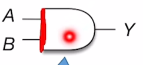](https://youke1.picui.cn/s1/2025/07/27/6885a086bf77b.png)
`(关键标志,左边是一条直竖线)`

#### 2. 或运算（OR）  
- 表达式：$Y = A + B$  
- 真值表：有 1 出 1，全 0 出 0  
- 门电路符号： 
[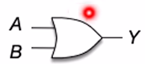](https://youke1.picui.cn/s1/2025/07/27/6885a12689851.png)
`(关键标志,左边是一条直弧线)`

#### 3. 非运算（NOT ）  
- 表达式：$Y = \overline{A}$  
- 真值表：入 1 出 0，入 0 出 1  
- 门电路符号： 
[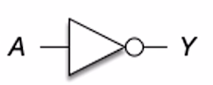](https://youke1.picui.cn/s1/2025/07/27/6885a15f7b52e.png)
`(关键标志,有小圆圈和三角形)`

#### 4. 复合逻辑运算（与非、或非、异或、同或等） 
- **与非运算**：先与后非,$Y = \overline{A \cdot B}$ ，全 1 出 0，有 0 出 1
[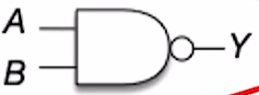](https://youke1.picui.cn/s1/2025/07/27/6885a24b84d59.png)

- **或非运算**：先或后非,$Y = \overline{A + B}$ ，全 0 出 1，有 1 出 0 
[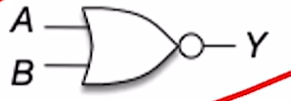](https://youke1.picui.cn/s1/2025/07/27/6885a2a666071.png)

- **异或运算**：$Y = A \oplus B = \overline{A}B+A\overline{B}$ ，相异出 1，相同出 0 
[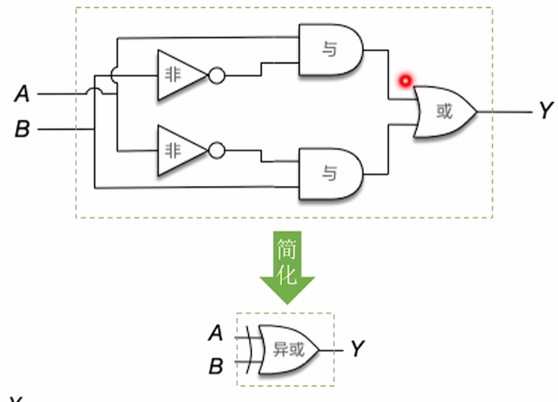](https://youke1.picui.cn/s1/2025/07/27/6885a2d5e9520.png)

- **同或运算**：$Y = A \odot B =\overline{A \oplus B}$ ，相同出 1，相异出 0  
- [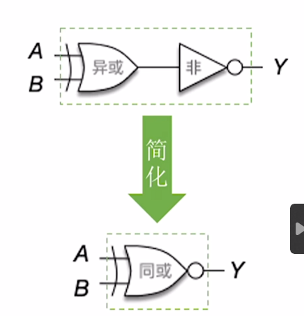](https://youke1.picui.cn/s1/2025/07/27/6885a33de64ff.png)

### （三）逻辑运算公式
- **优先级**:非>与>或 
- **分配律**：$A(C + D) = AC + AD$  
- **结合律**：$ABC = A(BC)$（与 ）、$A + B + C = A + (B + C)$（或 ）  
- **反演律（德摩根定律 ）**：$\overline{A + B} = \overline{A} \cdot \overline{B}$ 、$\overline{A \cdot B} = \overline{A} + \overline{B}$  
`(本质上逻辑表达式是对数字电路的数学描述,简化逻辑表达式,就是在简化电路设计,节省成本)`

### （四）硬件实现与应用  
- **门电路**：由晶体管实现，用于构建复杂逻辑电路（如加法器、多路选择器 ）  
- **多路选择器（MUX ）**：从多个输入中选一个输出（如 8 输入 1 输出 MUX，通过控制位选择通道 ）
[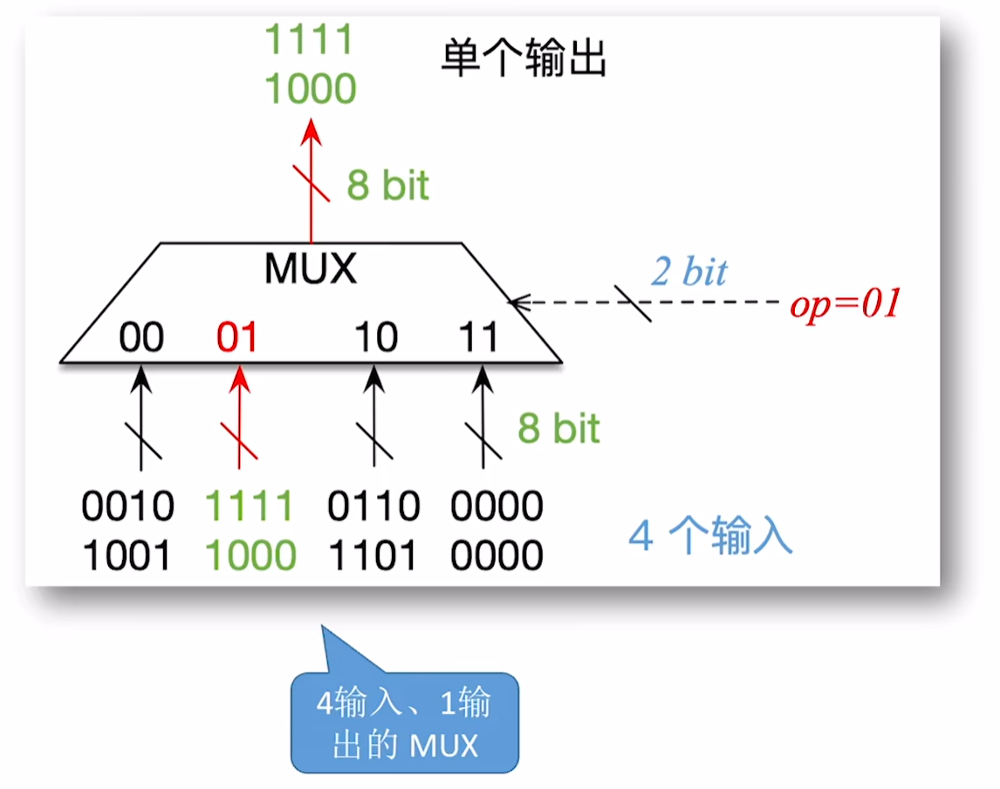](https://youke1.picui.cn/s1/2025/07/27/6885a4a39ebe0.png)
`(op为控制信号)`

- **三态门**：输出有高电平、低电平、高阻态，用于总线分时复用
[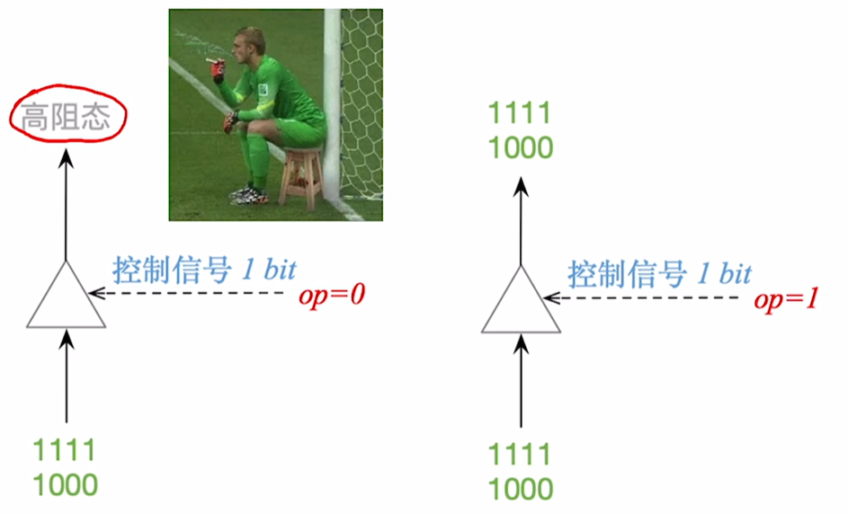](https://youke1.picui.cn/s1/2025/07/27/6885a56897e9d.png)

## 六、加法器原理
### （一）一位全加器  
输入：加数 $A_i$、被加数 $B_i$、低位进位 $C_{i-1}$  
输出：和 $S_i = A_i \oplus B_i \oplus C_{i-1}$ 、进位 $C_i = A_iB_i + (A_i \oplus B_i)C_{i-1}$  
结构示意图：  
[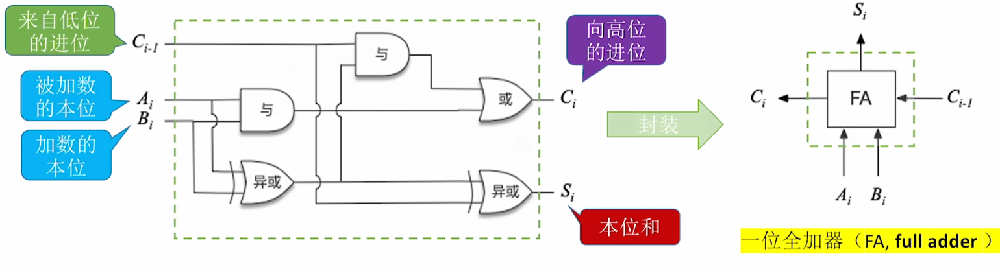](https://youke1.picui.cn/s1/2025/07/27/6885a61e9699f.png)

### （二）n 位加法器  
将 n 个一位全加器串联，低位进位连高位进位，实现多位数加法。  
不足：**进位传递延迟**（高位运算依赖低位进位，位数越多延迟越大 ）
[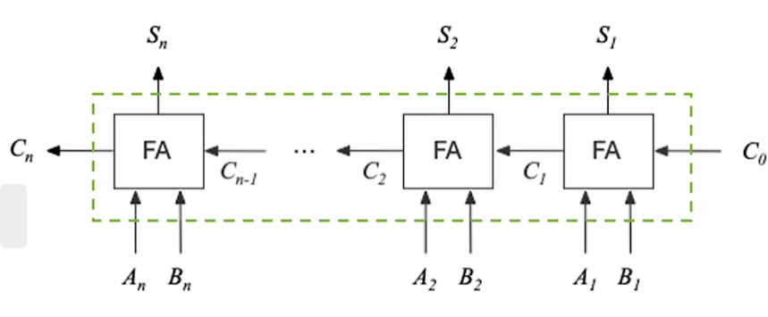](https://youke1.picui.cn/s1/2025/07/27/6885a6869bd5d.png)
`(串行进位的并行加法器)`  

### （三）并行进位加法器（改进）  
通过 ==先行进位逻辑（CLA）== 提前计算进位，减少延迟，例：  
[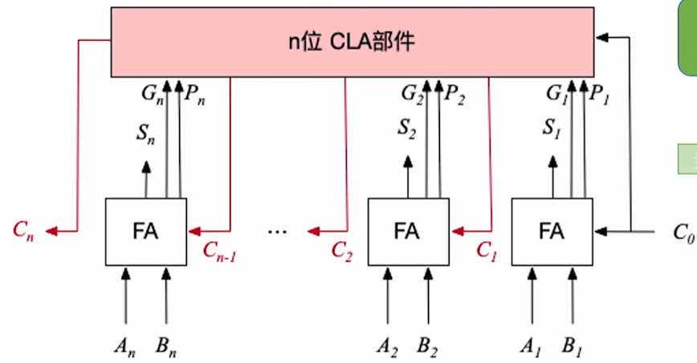](https://youke1.picui.cn/s1/2025/07/27/6885a6d7a3a17.png)
`(运算速度更快)`

### （四）带标志位的加法器  
生成标志位反映运算状态：  
- **OF（溢出标志）**：判断有符号数溢出（如两个正数相加结果为负 ）
  公式:$OF = C_n \oplus C_{n-1}$  
  （$C_n$：最高位的进位；$C_{n-1}$：次高位的进位 ）    
- **SF（符号标志）**：反映结果符号（与最高位相同 ）
公式:$SF = S_n$  
  （$S_n$：运算结果的最高位，即符号位 ）  
- **ZF（零标志）**：结果为 0 时置 1 
  公式:$ZF = \overline{S_n + \dots + S_2 + S_1}$
  （仅当所有位全 0 时，$ZF = 1$ ） 
- **CF（进位标志）**：判断无符号数溢出（进位产生时置 1 ）
  公式:$CF = C_{\text{out}} \oplus C_{\text{in}} = C_n \oplus C_0$  
  （$C_{\text{out}}$：最高位的进位/借位；$C_{\text{in}}$：最低位的进位/借位 ）  
[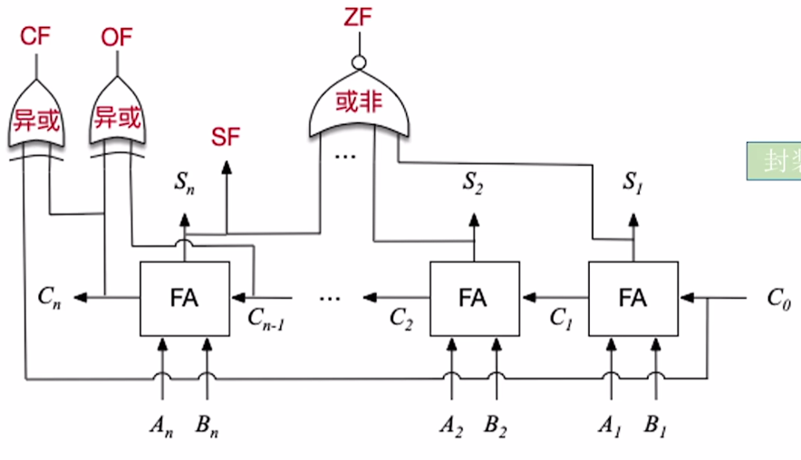](https://youke1.picui.cn/s1/2025/07/27/6885cc6fd5cac.png)  

## 七、算术逻辑单元（ALU）
### （一）功能与控制
==ALU 是运算器的核心，加法器是 ALU 的核心==.ALU 的运算数和运算结果位数与机器字长相同.
ALU的功能包括：  
- **算数运算**：加、减、乘、除等  
- **逻辑运算**：与、或、非、异或、移位等  
- **其他操作**：求补码、码制转换（如二进制转十进制 ）  

功能由**控制器**通过控制信号调度，ALU 输出运算结果与机器字长相符。  

结构示意图:
[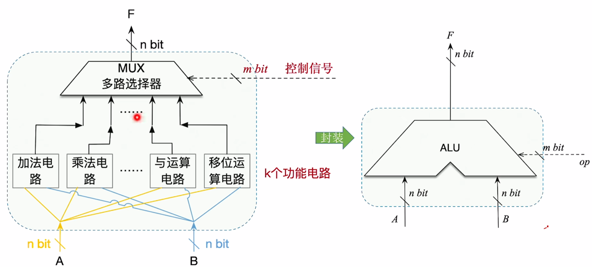](https://youke1.picui.cn/s1/2025/07/27/6885cf16a0c72.png)
运算器由算数逻辑单元,PSW寄存器和其他运算相关的各种寄存器组成,受到控制器的控制信号控制.其中PSW存储ALU的标志信息(ZF,OF,SF,CF)

## 八、定点数的移位运算
### （一）移位运算分类与应用
移位运算通过改变数位和小数点位置，调整位权，==快速实现乘除（左移×2、右移÷2）== ，核心分两类：  

#### 1. 逻辑移位（常处理无符号整数）  
- **逻辑左移**：高位移出丢弃，低位补 0 → 相当于 $×2$（若移出位为 1，超出无符号数表示范围，产生溢出 ）  
- **逻辑右移**：低位移出丢弃，高位补 0 → 相当于 $÷2$（若移出位为 1，丢失精度，无符号数无法表示小数 ）  

#### 2. 算术移位（常处理带符号整数(计算机中通常用补码表示)）
- **算术左移**：符号位不变，高位移出丢弃，低位补 0 → 若左移前后符号位不同，溢出（超出范围 ）  
- **算术右移**：符号位不变，低位移出丢弃，高位补符号位 → 保持数值符号，调整大小  

### （二）移位运算的意义  
在不依赖乘除器时，高效实现数值缩放、小数点调整、数据处理，是计算机底层运算基础。  

## 九、定点数的加减运算
### （一）补码的加减运算规则  
计算机以==补码==为基础执行加减，公式：  
- 加法：$[A + B]_{\text{补}} = [A]_{\text{补}} + [B]_{\text{补}}$  
- 减法：$[A - B]_{\text{补}} = [A]_{\text{补}} + [-B]_{\text{补}}$  

补码运算需关注**溢出问题**（结果超出定点数表示范围 ）。  

### （二）溢出判断方法  
#### 1. 单符号位判断（方法一 ）  
- 正数 + 正数 = 负数 → 上溢  
- 负数 + 负数 = 正数 → 下溢  
- 溢出逻辑：$V = A_fB_f\overline{S_f} + \overline{A_f}\overline{B_f}S_f$（$A_f、B_f$ 为操作数符号位，$S_f$ 为结果符号位 ）  
- $V=0$ 无溢出，$V=1$ 有溢出  

#### 2. 进位位判断（方法二 ）  
符号位进位 $C_s$ 与最高数值位进位 $C_1$ 不同时，说明溢出（异或逻辑：$V = C_s \oplus C_1$ ）  

#### 3. 双符号位判断（方法三 ）  
- 正数符号位 `00`，负数符号位 `11`  
- 运算后符号位为 `01`（上溢 ）或 `10`（下溢 ）时，判定溢出  
- 逻辑：$V = S_{f1} \oplus S_{f2}$（$S_{f1}、S_{f2}$ 为双符号位 ）  

## 十、无符号数的加减运算
### （一）运算规则  
- **加法**：低位到高位逐位相加，产生进位则传递  
- **减法**：减数各位取反 +1（转为补码 ），按加法运算  

### （二）溢出判断  
n 位无符号数表示范围 $0 - 2^n - 1$，超出则溢出：  
- 加法溢出：最高位产生进位=1（$CF=1$ ）  
- 减法溢出：最高位产生进位=0（$CF=0$ ）,说明实际结果小于0,因为无符号数只能表示非负数  

## 十一、加减运算电路
补码加减运算电路可统一处理有符号数/无符号数：  
- 加法：直接输入补码相加  
- 减法：减数取反 +1（转为补码）后相加  

电路核心：==加法器 + 控制逻辑==

结构示意图：
[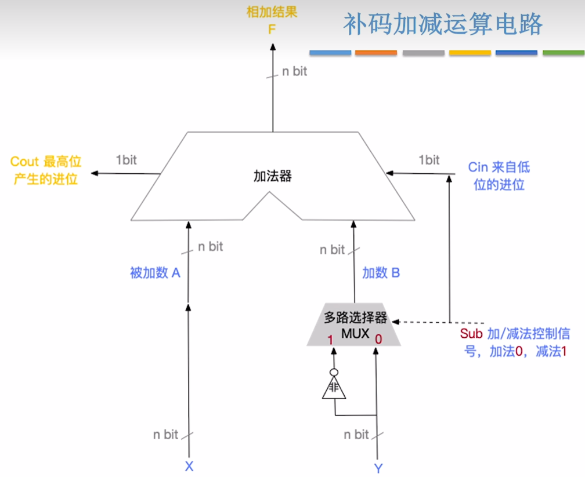](https://youke1.picui.cn/s1/2025/07/27/6885d6f6bb144.png)
$CF = C_{\text{out}} \oplus C_{\text{in}}$

## 十二、无符号整数的乘法运算
### （一）硬件原理（加法器迭代）  
[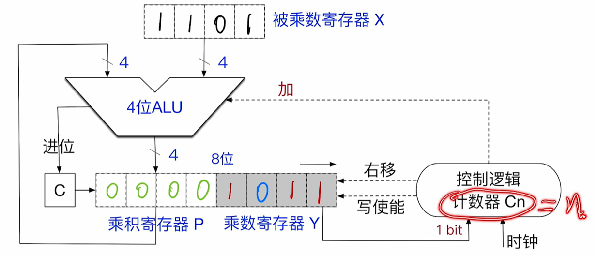](https://youke1.picui.cn/s1/2025/07/27/6885d7ee0c269.png)
`(加法器只能同时计算两数相加)`
1. **初始化**：乘数存寄存器 X，被乘数存寄存器 Y，乘积寄存器 P 清 0，计数器 C 设为乘数位数 n  
2. **迭代过程**：  
   - 检查乘数最低位，若为 1，P = P + Y（加法器累加 ）  
   - 右移 P 和 X（逻辑右移 ），计数器 C 减 1  
   - 重复至 C = 0  
3. **溢出判断**：结果需 2n 位存储，若高位丢失则溢出（如 n 位乘数×n 位被乘数，结果超 2n 位 ）

`(加法器只能同时计算两数相加)`

### （二）特殊情况  
乘数或被乘数为 0 时，直接输出 0，跳过迭代。  

### （三）溢出判断和处理
[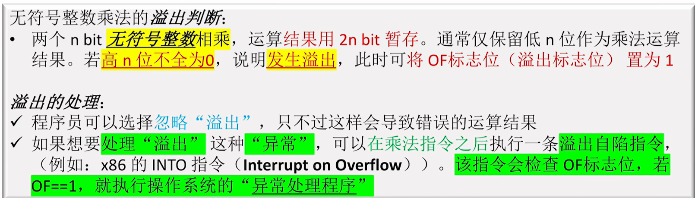](https://youke1.picui.cn/s1/2025/07/27/6885d8fb8d310.png)

## 十三、带符号整数的乘法运算
### （一）硬件原理（补码乘法电路迭代）
[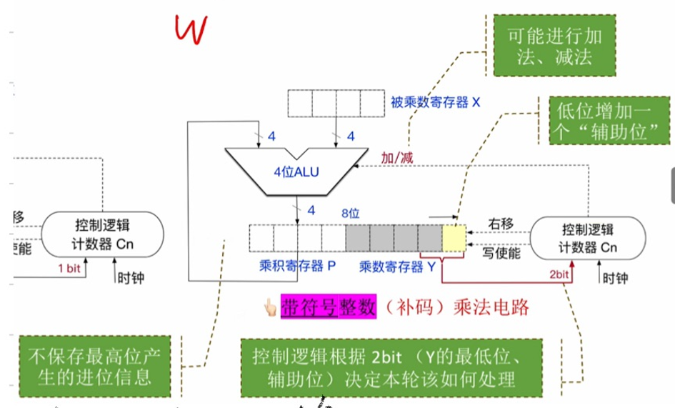](https://youke1.picui.cn/s1/2025/07/27/6885dc4e93edd.png)  
1. **初始化**：被乘数（补码）存寄存器 X，乘数（补码）存寄存器 Y，乘积寄存器 P 清 0，“辅助位”置 0，计数器 $C_n$ 设为乘数位数 n  
2. **迭代过程**：  
   - 将乘数寄存器 Y 的最低位、辅助位（共 2bit）送入“控制逻辑”判断  
   - 根据判断结果，决定对乘积寄存器 P 执行 `+[X]补` / `- [X]补`（等价 `+[-X]补`） / `+0` 操作（4 位 ALU 实现加减）
  [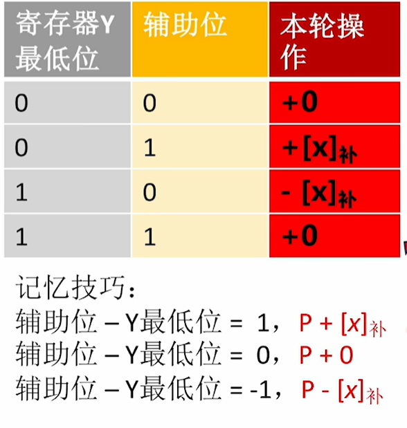](https://youke1.picui.cn/s1/2025/07/27/6885ddf5080e8.png)  
   - 将 [P, Y,辅助位] 视为整体==算术右移一位==（高位补符号位，保持补码性质），计数器 $C_n$ 减 1  
   - 重复至 $C_n = 0$  
1. **溢出判断**：  
   - 两个 n 位补码相乘，结果需 2n 位暂存（P 存高位，Y 存低位）  
   - 若仅保留低 n 位，对比高 n 位与低 n 位：若高 n 位不全为符号位，置 $OF = 1$（溢出标志位,CF仅用于无符号加减溢出判断）  

### （二）特殊情况  
当被乘数、乘数中有一个为全 0 时，直接输出 0，跳过迭代。  

### （三）溢出处理 
- 若程序需严谨处理溢出，可在乘法指令后执行==溢出中断指令（如 x86 的 `INTO`）==：检测 $OF$ 标志位，若 $OF = 1$，触发操作系统异常处理。  
- 多数架构默认保留低 n 位结果，需手动判断 $OF$ 确保运算正确。  

## 十四、无符号数的除法运算原理

### （一）硬件原理（除法器迭代流程）
[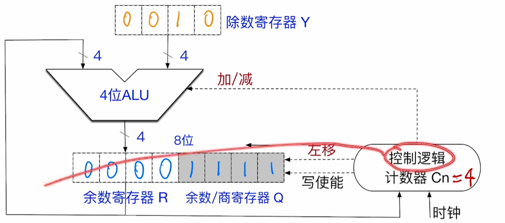](https://youke1.picui.cn/s1/2025/07/27/6885e0c4bf6c6.png)  
1. **初始化**：  
    - 若被除数不足 2n bit，需将其扩展为 2n bit（统一为 `2n bit ÷ n bit` 格式 ）。  
    - 除数存入寄存器 Y，被除数存入寄存器 [R, Q] 并完成==零扩展==（补高位 0 ）。  
    - 计数器 $C_n$ 初始值设为 n（n 为除数位数 ）。  
2. **特殊情况检查**（先执行）：  
    - 若除数为 0，触发“除数为 0”异常，终止除法运算，调用操作系统异常处理。  
    - 若被除数 < 除数（`[R, Q] < Y` ），则商 Q = 0，余数 R = 被除数，除法器停止运算。  
3. **迭代过程**（共 n 轮 ）：  
    - **上商判断**：通过R-Y来比较余数寄存器 R 与除数寄存器 Y，若 $[R] \geq [Y]$，则上商 1；否则上商 0 ,上商前R+Y。  
    - **特殊处理（商溢出检查）**：若第一次上商为 1，触发“商溢出”异常（因无符号数商最多 n 位，实际会得到 n+1 位商，最高位商仅用于溢出判断 ）。  
    - **移位与运算**：  
        - 左移 [R, Q]（逻辑左移，空出低位用于上商 ）。  
        - 上商前,先执行R=R-Y,若R>=0,则上商为 1;若R溢出(即R<0),则先执行R=R+Y,再上商为 0。  
        - 计数器 $C_n$ 减 1，重复至 $C_n = 0$ 。  
4. **结果与溢出**：  
    - 最终保留 n bit 商（寄存器 Q ）、n bit 余数（寄存器 R ）。  
    - 仅 `2n bit ÷ n bit`（双精度除法）可能发生==商溢出==（因商实际位数可能超 n bit ）；`n bit ÷ n bit`（单精度除法）不会溢出。  

### （三）关键逻辑补充  
- **左移的作用**：通过逻辑左移 [R, Q]，逐步将被除数高位纳入余数寄存器 R，配合减法实现逐位试商。  
- **商溢出判断**：双精度除法中，若第一轮上商为 1，说明商实际为 n+1 位，超出 n bit 存储能力，需触发溢出（无符号数单精度除法因被除数已扩展为 2n bit，不会出现此情况 ）。  

## 十五、IEEE 754 浮点数表示

### 一、基础概念
#### （一）标准背景
由 IEEE（电气与电子工程师协会）制定，规定计算机中二进制浮点数表示格式，涵盖 `float`（单精度，32 位 ）、`double`（双精度，64 位 ）等，解决浮点数统一存储与跨平台兼容问题。

#### （二）浮点表示必要性
计算机字长有限（如 `int`、`short` 范围固定 ），浮点数借科学计数法思想（尾数 + 阶码 ），在有限位宽内平衡数值范围与精度。

### 二、格式拆解（以单精度 `float` 为例）
[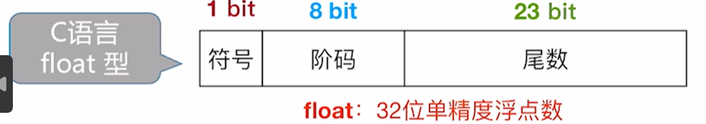](https://youke1.picui.cn/s1/2025/07/27/6885e8a56e5e3.png)
| 字段     | 符号位（1 bit） | 阶码（8 bit）       | 尾数（23 bit）         |
|----------|-----------------|---------------------|------------------------|
| 作用     | 表示正负（0 正，1 负） | 控制数值范围（指数） | 决定数值精度（有效数） |
| 双精度对应 | 1 bit           | 11 bit              | 52 bit                 |

- 表示范围:
[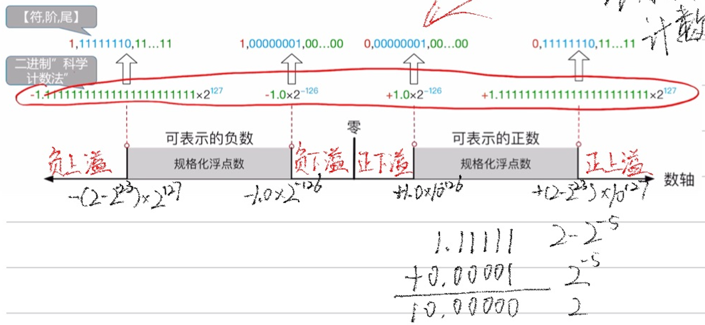](https://youke1.picui.cn/s1/2025/07/27/6885e8ecd020a.png)

#### （一）符号位（Sign）
- 表示数值正负，`0` 正、`1` 负。
- 存在 `+0`（符号位 0 ）和 `-0`（符号位 1 ），数值等价，部分运算中行为有别。

#### （二）阶码（Exponent）
- **偏移表示**：阶码的存储用移码表示,单精度阶码 = 实际指数 + 127(偏置值$2^7-1$)（双精度 + 1023 ），避免存储负指数。

#### （三）尾数（Mantissa）
- **隐含 1 的规格化**：规格化数尾数默认隐含前缀 `1.`（如 `1.xxxx...` ），单精度实际有效位 `23 + 1 = 24` 位（双精度 `52 + 1 = 53` 位 ）。

### 三、数值分类与解读（单精度为例）
#### （一）规格化数（Normal）
- **条件**：阶码不全为 0、不全为 1 。
- **计算**：  
  $$
  \text{数值} = (-1)^{\text{符号位}} \times (1 + \text{尾数}) \times 2^{\text{阶码} - 127}
  $$
- **示例**：`0 10000001 01000000000000000000000`（符号位 0，阶码 129，尾数 `0.1` ），计算得 $(+1) \times (1 + 0.1) \times 2^{129 - 127} = 1.1 \times 4 = 4.4$ 。

#### （二）非规格化数（Denormal）
- **条件**：阶码全为 0，尾数不全为 0 。
- **计算**：  
  $$
  \text{数值} = (-1)^{\text{符号位}} \times (0 + \text{尾数}) \times 2^{-126}
  $$
- **作用**：表示接近 0 的小数，填补规格化数无法表示的“最小值以下”区间。
- 非规格化数的阶码实际为 - 126（而非阶码全 0 对应的 - 127），目的是让最小规格化数（$1.0×2^{−126} $）与最大非规格化数（$0.111...×2^{−126} $）平滑衔接，避免数值断层。

#### （三）零（Zero）
- **条件**：阶码全为 0，尾数全为 0 。
- **分类**：`+0`（符号位 0 ）和 `-0`（符号位 1 ），数值等价，部分运算（如除法 ）中行为不同。

#### （四）无穷大（Infinity）
- **条件**：阶码全为 1，尾数全为 0 。
- **分类**：`+∞`（符号位 0 ）和 `-∞`（符号位 1 ），用于溢出（如 `1e308 × 1e308` ）或除以 0 运算（如 `1/0` ）。

#### （五）非数（NaN）
- **条件**：阶码全为 1，尾数不全为 0 。
- **作用**：表示无效运算结果（如 `√-1`、`0/0` ），分 ==signaling NaN（触发异常）== 和 ==quiet NaN（仅标记无效）==。
[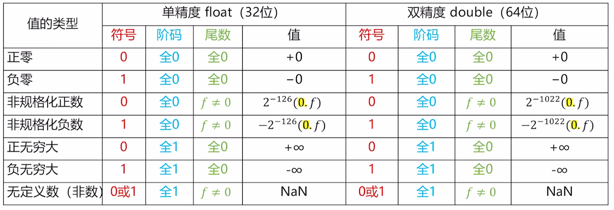](https://youke1.picui.cn/s1/2025/07/27/6885e7fa39b4f.png)

### 四、浮点运算的溢出与处理
[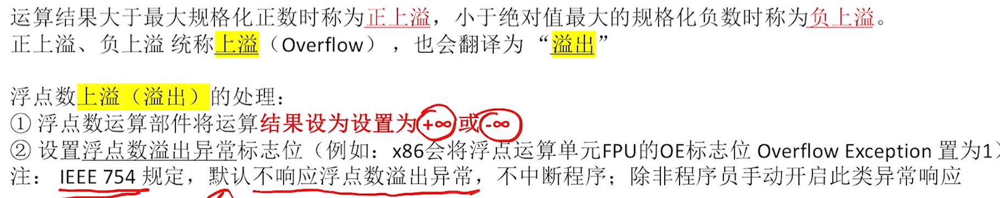](https://youke1.picui.cn/s1/2025/07/27/6885e7b52de47.png)
[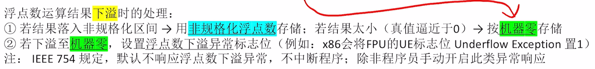](https://youke1.picui.cn/s1/2025/07/27/6885e7b50f679.png)

## 十六、数据的存储和排列
### （一）大小端模式
[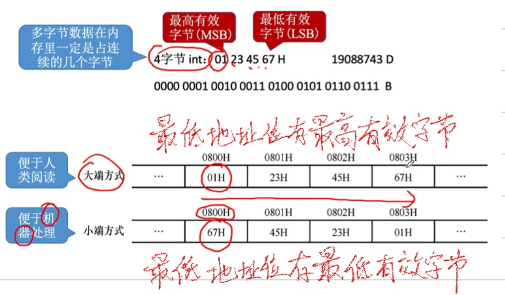](https://youke1.picui.cn/s1/2025/07/27/6885e9edbae16.png)
- **大端（Big-Endian ）**：低地址存高字节，高地址存低字节（符合人类读写习惯 ）  
- **小端（Little-Endian ）**：低地址存低字节，高地址存高字节（符合计算机运算逻辑 ）  

### （二）边界对齐
[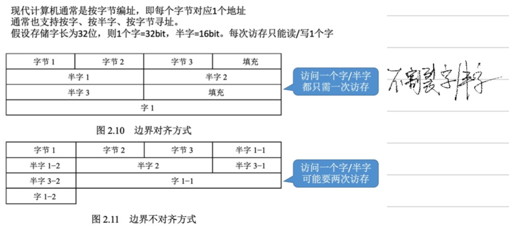](https://youke1.picui.cn/s1/2025/07/27/6885e9eb61818.png)  
- 数据存储需按地址对齐（如 4 字节数据存地址 0、4、8… ），避免跨边界访问影响效率，编译器自动处理或手动指定。
- 计算机内存通常按 ==“字长”（如 4 字节、8 字节）== 块访问，未对齐的数据（如 4 字节数据存在地址 1）需要两次访问（取地址 0-3 和 4-7，再拼接），而对齐数据（地址 0）可一次访问，因此对齐能减少访问次数。