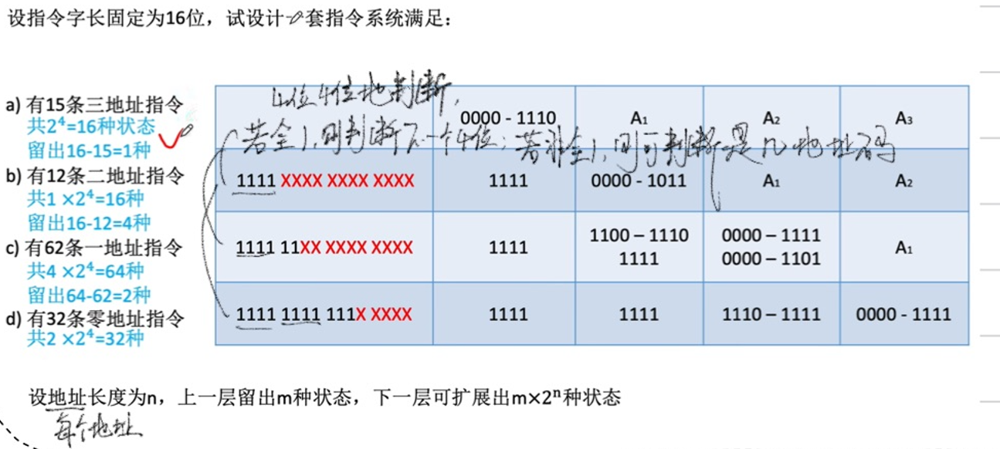
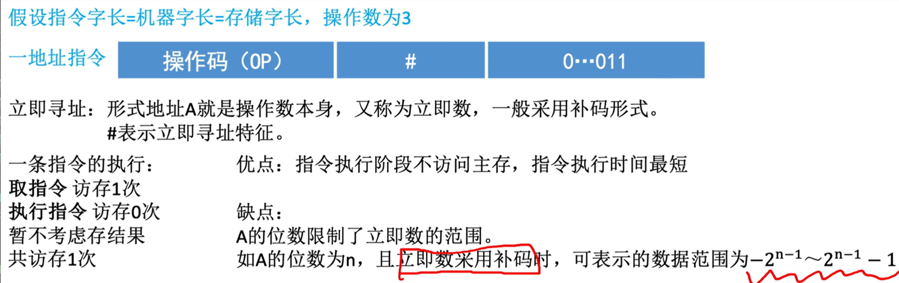
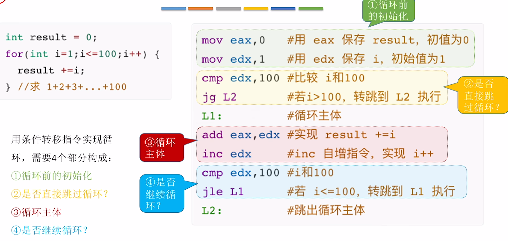
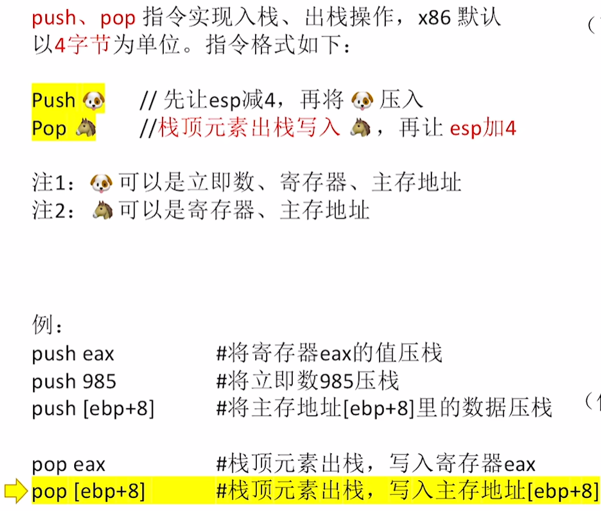

# 第四章 指令系统

## 一、指令格式
### （一）指令定义
指令（又称机器指令）：是计算机执行某种操作的命令，是计算机能够识别和执行的操作命令，是计算机运行的最小功能单位，一台计算机只能执行自己指令系统中的指令，也称为**机器指令**，是软件与硬件的接口。一台计算机的所有指令的集合构成改机的指令系统，也称为指令集。  
注：一台计算机只能执行自己指令系统中的指令，不能执行其他系统的指令。  
> 例：x86架构（PC）、ARM架构（手机、平板 ）

### （二）指令格式分类
#### 1.按地址码数量分类
指令 = 操作码（OP） + 地址码（A）  
##### 零地址指令
- 特点：不需要操作数，如空操作、停机、关中断等指令  
- 应用场景：
  - 程序控制（如停机指令 `HLT` ，空操作指令 `NOP` ，让计算机短时间忙等 ）
  - 堆栈计算机，两个操作数隐含存放在栈顶和次栈顶，计算结果压回栈顶  

##### 一地址指令
- 格式：`OP A`  
- 功能：  
  - 1. 只需要一个操作数，如加1、减1、取反、求补等
指令含义：`(OP(A1)->A1)`,完成一条指令需要3次访存：取指->读A1->写A1 
  - 2. 需要两个操作数，其中一个隐含在某个寄存器中（如隐含在ACC）
指令含义: `(ACC) OP (A) → ACC`,完成一条指令需要2次访存：取指->读A1
  > 文章中的访存是狭义的访存，即访问主存。由于访问主存的时间比访问寄存器的时间长，因此狭隘的理解为主存

##### 二地址指令
- 格式：`OP A1 A2`  
- 功能：常用于两个操作数的算术运算、逻辑运算相关指令
- 指令含义：`(A1) OP (A2) → A1`,完成一条指令需要4次访存：取指->读A1->读A2->写A1

##### 三地址指令
- 格式：`OP A1 A2 A3`  
- 功能：常用于两个操作数的算术运算、逻辑运算相关指令
- 指令含义：`(A1) OP (A2) → A3`,完成一条指令需要4次访存：取指->读A1->读A2->写A3

##### 四地址指令
- 格式：`OP A1 A2 A3 A4`  
- 功能：指令含义 `(A1) OP (A2) → A3`，`A4` 为下一条需要执行的指令地址,完成一条指令需要4次访存：取指->读A1->读A2->写A3
- 说明：正常情况下，取指令为 `(PC)+1 → PC` （指出下一条指令地址）；遇到转移指令，`A4` 会覆盖 `PC` ，实现程序跳转  

#### 2.按指令长度分类
- **指令字长**：一条指令的总长度（可能会变）  
- **机器字长**：CPU进行一次整数运算所能处理的二进制数据的位数（通常和ALU直接相关）  
- **存储字长**：一个存储单元中的二进制代码位数（通常和MDR位数相同）

##### 依据指令长度与机器字长的倍数关系，可分类为：  
- 半字长指令：指令长度是机器字长的1/2  
- 单字长指令：指令长度等于机器字长  
- 双字长指令：指令长度是机器字长的2倍
>指令字长会影响取指令所需时间。例如：  
若 `机器字长=存储字长=16bit`，取一条双字长指令需要**两次访存**（一次访存仅能读取16bit，双字长指令需32bit ）

##### 指令字结构类型  
- **定长指令字结构**：指令系统中所有指令的长度都相等  
- **变长指令字结构**：指令系统中各种指令的长度不等 

#### 3.按操作码长度分类
##### 定长操作码
- 定义：指令系统中所有指令的操作码长度相同（如 `n` 位操作码 → 最多 `2ⁿ` 条指令 ）  
- 优势：控制器设计简单（译码逻辑固定）  
- 劣势：指令扩展性差（操作码位数固定，新增指令难，灵活性低）  

##### 可变长操作码
- 定义：指令系统中各指令的操作码长度可变  
- 实现方式：短指令用短操作码，长指令用长操作码（通过操作码区分长度 ）  
- 优势：指令扩展性好（灵活新增指令，适应复杂功能，灵活性高）  
- 劣势：控制器设计复杂（需动态译码、判断操作码长度）  

#### 4.按操作类型分类
##### 数据传送类（主存与CPU间数据传送）
- **LOAD**：把存储器中的数据放到寄存器中（源：存储器；目的：寄存器 ）  
- **STORE**：把寄存器中的数据放到存储器中（源：寄存器；目的：存储器 ）  

##### 运算类  
包含算术逻辑操作 + 移位操作，用于数据运算处理：  
- **算术操作**：加、减、乘、除、增1、减1、求补、浮点运算、十进制运算  
- **逻辑操作**：与、或、非、异或、位操作、位测试、位清除、位求反  
- **移位操作**：算术移位、逻辑移位、循环移位（带进位和不带进位）  

##### 程序控制类（改变程序执行顺序）  
实现程序流程跳转、调用返回等：  
- 无条件转移：`JMP`  
- 条件转移：`JZ`（结果为0）、`JO`（结果溢出）、`JC`（结果有进位）  
- 调用和返回：`CALL`（调用）、`RETURN`（返回）  
- 陷阱：`Trap`与陷阱指令  

##### 输入输出类（I/O，CPU和I/O设备间数据传送）  
实现CPU寄存器与IO端口的数据传送（端口即IO接口中的寄存器 ）  

### （三）拓展操作码指令格式
定长指令字结构+可变长操作码->拓展操作码指令格式
`(不同地址数的指令使用不同长度的操作码)`

#### 1.扩展操作码举例
指令字长为16位，每个地址码占4位：  
前4位为基本操作码字段OP，另有3个4位长的地址字段A₁、A₂和A₃。
  

##### 三地址指令  
4位基本操作码若全部用于三地址指令，理论有16条。  
但至少须将`1111`留作扩展操作码之用，因此：  
三地址指令为**15条**（用`0000 ~ 1110`表示 ）
>1111用来判断是几地址指令  

##### 二地址指令  
将`1111`作为扩展标识，此时操作码长度扩展为8位（4位基本 + 4位扩展 ）。  
需再留`1111 1111`作后续扩展，因此：  
二地址指令为**15条**（用`1111 0000 ~ 1111 1110`表示 ）  

##### 一地址指令（继续扩展场景）  
操作码长度再扩展为12位（8位已用 + 4位新扩展 ）。  
需留`1111 1111 1111`作零地址指令扩展，因此：  
一地址指令为**15条**（用`1111 1111 0000 ~ 1111 1111 1110`表示 ）  

##### 零地址指令（最终扩展场景）  
操作码长度扩展为16位（12位已用 + 4位最后扩展 ）。  
零地址指令为**16条**（用`1111 1111 1111 0000 ~ 1111 1111 1111 1111`表示 ）  

#### 2.设计要求
- 不允许短码是长码的前缀，即短操作码不能与长操作码的前面部分的代码相同。（例：若短操作码是`1110`，长操作码不能以`1110`开头，避免解码混淆 ）  
- 各指令的操作码一定不能重复，确保指令唯一识别。  

- 通常情况下：  
  - 对使用频率较高的指令，分配较短的操作码；  
  - 对使用频率较低的指令，分配较长的操作码。  
  - 尽可能减少指令译码和分析的时间，提升指令执行效率（高频指令因短码可更快识别、执行 ）。
  

## 二、指令寻址

## 三、数据寻址
确定本条指令的地址码指明的真实地址

- 指令中，寻址特征有专门的寻址方式位
- 多地址指令中，各地址都有各自的寻址特征和形式地址
- 形式地址(A)不等于有效地址(EA)，有效地址是能求出操作数的真实地址

### 数据寻址的分类
#### 1.直接寻址

`(如果想修改操作数地址，必须改动指令本身的编码，但程序经编译后，指令一般放在只读的内存区域，很难直接改，灵活性差，如果改，一般就要重写程序，重新编译)`

#### 2.间接寻址

`(例如，调用子程序时，把主程序后续要执行的指令的地址（返回地址）存到某存储单元，再将该单元地址作为形式地址 A 写入调用指令。子程序执行完，用间接寻址指令，通过 A 找到返回地址，精准跳回主程序继续执行。)`

#### 3.寄存器寻址

#### 4.寄存器间接寻址

#### 5.隐含寻址

#### 6.立即寻址

#### 7.偏移寻址
- 基址寻址

##### A.基址寄存器的管理与特性  
- **面向系统**：基址寄存器是面向操作系统的，其内容由**操作系统或管理程序确定**。  
- **执行时状态**：程序执行过程中，基址寄存器内容**作为基地址保持不变**；形式地址（偏移量）**可变**。  
- **通用寄存器适配**：若用通用寄存器作基址寄存器，用户可决定“哪个寄存器当基址寄存器”，但**内容仍由操作系统确定**。  

##### B.“可变”的准确含义  
“可变”**不是指单条指令执行时偏移量变化**，而是：  
在**多条指令中，不同指令的形式地址（偏移量）可不同**，通过基地址+不同偏移量访问不同内存区域。  

##### C.优点与应用价值  
- **扩大寻址范围**：基址寄存器位数＞形式地址A的位数时，有效地址范围更大（$EA = 基地址 + 偏移量$ ）。  
- **支持多道程序/浮动程序**：用户无需关注程序在主存的具体位置，操作系统通过改基址寄存器值，就能让程序在内存“浮动”（加载到不同区域仍能正确执行 ），利于多道程序设计、编制浮动程序（整个程序在内存中可移动 ）。
---

- 变址寻址

- **面向用户**：变址寄存器是面向用户的，程序执行过程中，**变址寄存器的内容可由用户改变**（IX作为偏移量），形式地址A**不变（作为基地址）** 。  
- **优点**：  在数组处理中，可设`A`为数组首地址，通过**不断改变变址寄存器IX内容**，轻松生成数组中任一数据地址，**特别适合编制循环程序** 。
- **基址&变址复合寻址**：

---
- 相对寻址

- **优点**：操作数地址不固定，随**PC值变化而变化**，且与指令地址始终相差固定值，便于**程序浮动（一段代码在程序内部浮动 ）**。相对寻址**广泛应用于转移指令**，通过PC相对偏移实现灵活跳转，适配程序内代码位置调整需求。  

#### 8.堆栈寻址

## 四、高级语言与机器级代码之间的对应
`(机器级代码包括汇编语言和机器语言)`
### （一）x86（Intel）汇编语言指令基础

**以mov指令为例**：

- d(destination,目的地)不能是常量，只可以是主存/寄存器地址，s(source,发源地)
- d还可以表示为`<reg>或<mem>`；s还可以表示为`<reg>或<mem>或<con>`
- mov不支持两个地址都来自主存，若要实现，可先移入寄存器，再移入主存，也就是用两条mov指令实现

**x86架构中CPU的寄存器**

### （二）常用的x86汇编指令
**算数运算指令**：

**逻辑运算指令**：

**其他指令**：

### （三）AT&T格式VSIntel格式
前者是Unix、Linux的常用格式；后者是Windows的常用格式

`(比例因子和偏移量的单位是字节B)`

## 五、选择语句的机器级表示
### 1.无条件转移指令

### 2.条件转移指令

## 六、循环语句的机器级表示
### 1.用循环条件转移指令实现循环
 
### 2.用loop实现循环

`(只能用ecx作计数器，因为loop指令专门只处理ecx)`

## 七、函数调用的机器级表示
### 1.call和ret指令

### 2.函数调用栈再内存中的位置

### 3.访问栈帧数据：
**法1**：

**法2**：

### 4.切换栈帧

### 5.变量的传递

`(函数的返回值通常存在eax寄存器)`

## 八、CISC和RISC

